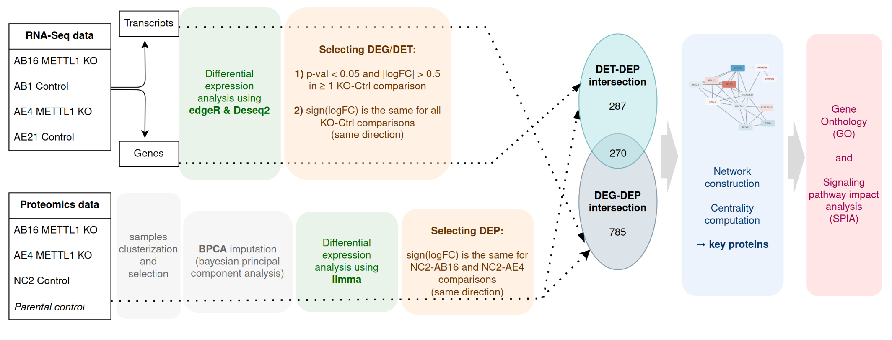

# Mechanisms of the METTL1 knockout resistance in the OE33 cell line
> _by Anna Chechenina, ESCI-UPF_ <br>
> _completed at Han lab @ Milner Therapeutics Institute & Cambridge University_ <br>
> _Jan - Jul 2024_ <br>
> _supervised by Prof. Namshik Han and Dr. Gehad Youssef_


## Abstract

It has been demonstrated that 7-methylguanine (m7G) modification of tRNA is essential for cell proliferation, and the lack of m7G may result in tRNA decay. It was recently shown that it can play a significant role in oncogenic mRNA translation and carcinoma progression by stabilizing tRNA. In particular, it was proved that METTL1-mediated m7G modification drives oncogenic transformation.
One of the most often used models for esophageal cancer is the cell line OE33, which was established from the adenocarcinoma of the lower oesophagus, Barrett's metaplasia. Prior experiments in the lab demonstrated that OE33 cells are resistant to CRISPR and siRNA METTL1 knockout and do not exhibit any proliferation defect, but on the contrary, increase a proliferative activity.

In this study, we explore the resistance mechanism of the OE33 cell line to the METTL1 knockout to discover any potential compensatory mechanisms that allow cells to remain highly proliferative. The project consists of several steps involving the analysis of multi-omics data. The analysis of the transcriptomics and proteomics data for wild-type and METTL1 knockout samples is performed to infer genes with altered expression and enriched pathways and build protein-protein interaction networks. tRNA-interacting proteins and methyltransferases are of particular interest since they might play essential roles in alternative tRNA modifications. Since METTL1 represents a promising anti-cancer target, this research has the potential to guide future therapeutic approaches and offers important insights into the mechanisms governing oncogene activity in esophageal cancer.

## Methods overview



## Directory structure

You can find all scripts used for the project in the `src` folder. Transcriptomics and proteomics analysis was performed primarily in R, whereas the protein-protein interaction networks analysis was done in Python and Cytoscape was used for the visualisation.

## How to reproduce the code?

First of all, you should clone this repository by running the following command in your terminal:

```bash
git clone https://github.com/checheanya/OE33_METTL1_project && cd OE33_METTL1_project
```

Then, create a `conda/mamba` environment with necessary packages and activate it:

```bash
conda env create -f environment.yml
conda activate OE33_METTL1_project
```

### R scripts
In order to run R scripts, you have to install all the required libraries first. For the sake of consistency, all the analysis was performed in the custom R environment. You can set it up following the instructions below. 

0. Install R and R Studio to edit the code. The project was completed using the **R version 4.1.2**, session info:

```
R version 4.1.2 (2021-11-01)
Platform: x86_64-pc-linux-gnu (64-bit)
Running under: Ubuntu 22.04.4 LTS
```

1. First, you need to install the **renv** package and activate it:

```R
install.packages("renv")
library(renv)
```

2. Now you are ready to restore the environment using the provided `renv.lock` file and install all dependencies to run the code. Note, that it might take quite some time and might require some additional installations depending on your OS version. 

```R
renv::restore()
```

### Python scripts

The network analysis was performed mainly using Python library networkx. Python version 3.10 was used, all the required Python libraries are specified in the `environment.yml` file and will be installed once you set up the conda environment. 

## Contact info

I am happy to discuss the project and any questions you might have. Please, reach me out at [anna.chechenina@yahoo.com](mailto:anna.chechenina@yahoo.com).

_Anna Chechenina, May 2024_
